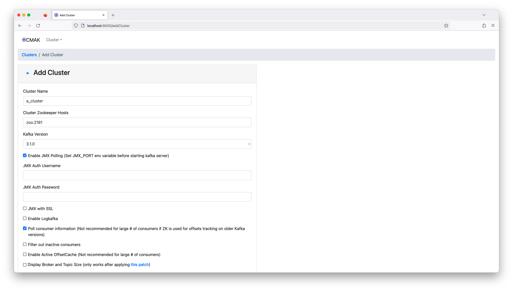
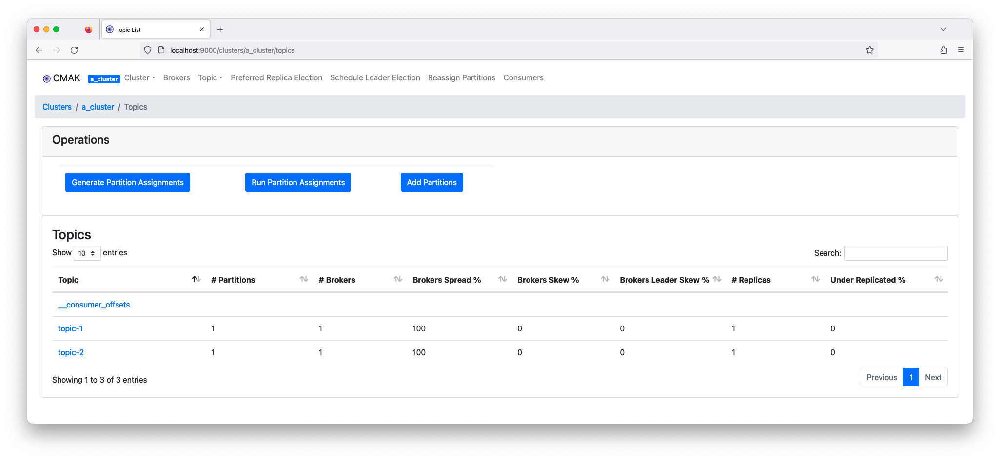

# kafka-manager

Docker Hub: [rurumimic/kafka-manager](https://hub.docker.com/repository/docker/rurumimic/kafka-manager)

Contents:

- Build: [Dockerfile](#dockerfile)
- Run [Docker Compose](#docker-compose)
- Open [Kafka Manager](#open-kafka-manager)
- [Screenshots](#screenshots)

---

## Refs

- [yahoo/CMAK](https://github.com/yahoo/CMAK)
- [sheepkiller/kafka-manager-docker](https://github.com/sheepkiller/kafka-manager-docker)

---

## Dockerfile

### Download latest version.zip

- [yahoo/CMAK/releases](https://github.com/yahoo/CMAK/releases)
  - version: `3.0.0.6`

unzip and rename directory: `cmak/`

### Edit Dockerfile

- [Dockerfile](Dockerfile)
- Update `KM_VERSION`

### Docker Image

```bash
VERSION=3.0.0.6
```

### Build Image

```bash
docker build -t rurumimic/kafka-manager:$VERSION .
docker tag rurumimic/kafka-manager:$VERSION rurumimic/kafka-manager:latest
```

### Publish Image

```bash
docker login
docker push rurumimic/kafka-manager:$VERSION
docker push rurumimic/kafka-manager:latest
```

---

## Docker Compose

### Edit docker-compose.yml

- Copy from: [docker-compose.sample.yml](docker-compose.sample.yml)
- Update `KAFKA_ADVERTISED_HOST_NAME: # <HOSTIP>` in `docker-compose.yml`

`docker-compose.sample.yml`: Line 24. Set `KAFKA_ADVERTISED_HOST_NAME: # <HOST_IP>`

```bash
cp docker-compose.sample.yml docker-compose.yml
```

Do not use localhost or 127.0.0.1 as the host ip.

```bash
# mac
ifconfig | grep inet

inet 192.168.XXX.XXX netmask 0xffffff00 broadcast 192.168.XXX.255
```

```yml
KAFKA_ADVERTISED_HOST_NAME: 192.168.XXX.XXX
```

### Start a cluster

```bash
docker compose up -d
```

### Clean up

```bash
docker compose down -v
```

---

## Open Kafka Manager

[localhost:9000](http://localhost:9000)

1. Cluster: Add Cluster
   1. Cluster Name: anything
   1. Cluster Zookeeper Hosts: `zoo:2181`
   1. Check:
      - Enable JMX Polling (Set JMX_PORT env variable before starting kafka server)
      - Poll consumer information (Not recommended for large # of consumers if ZK is used for offsets tracking on older Kafka versions)

---

## Screenshots



